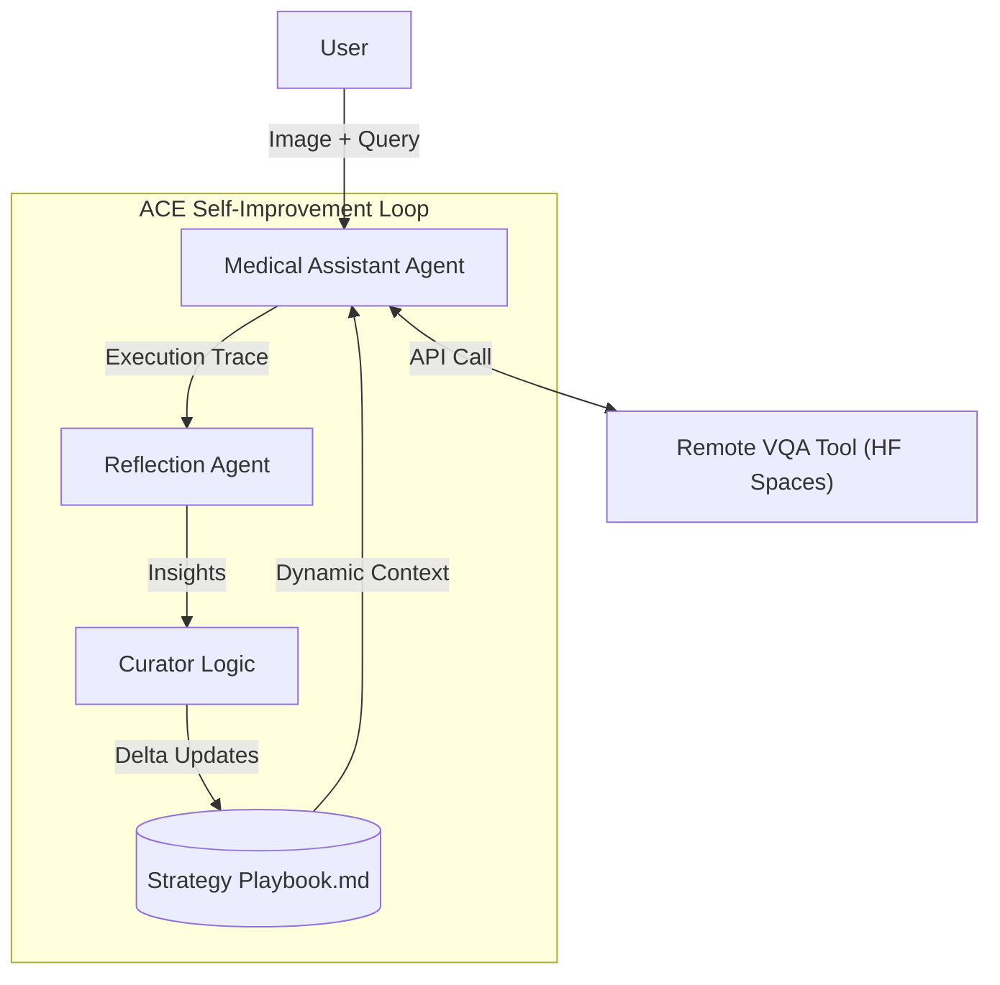

# Medical-ACE: Self-Improving Medical VQA System

**EECS6893 Big Data Analytics Final Project (Fall 2025)**  
*A Multi-Agent System that Reads, Understands, and Learns from Medical Images at Scale*

Medical-ACE is a next-generation medical visual question answering agent that uses **Agentic Context Engineering (ACE)** to continuously improve its performance. Unlike static models, ACE learns from every interaction, evolving a shared "Strategy Playbook" to handle complex diagnostic queries with increasing precision.

Check our Huggingface Gradio Backend here at https://huggingface.co/spaces/simon9292/MedicalQA. Remember: The link cannot fully demonstrate our work. This is just the inference backend our system are using. In actual workflow, our ACE multi-agent systems calls this backend's API.

---

## Key Features

### Self-Improving ACE Framework
Implements the **Reflect-Curate-Execute** loop (arXiv:2510.04618):
- **Generator**: GPT-5.1 powered agent with dynamic prompt injection.
- **Reflector**: Background agent that analyzes execution traces for success/failure signals.
- **Curator**: Updates a persistent `playbook.md` with "delta updates" (merge, refine, prune).
- **Playbook**: Evolving memory of medical VQA strategies (e.g., "Use 5-fold fan-out for ambiguous slides").

### Specialized Medical VQA
- **Vision Backbone**: BLIP + Custom Multi-Token Projector.
- **Reasoning**: TinyLlama-1.1B aligned with Direct Preference Optimization (DPO) on UltraMedical data.
- **Deployment**: Hosted on **HuggingFace Spaces** for scalable, GPU-backed inference.

### Agentic Orchestration
- **LangGraph**: Stateful multi-agent orchestration with persistent threading.
- **Async Learning**: Reflection runs in "fire-and-forget" background threads to maintain low user latency.

---

## System Architecture



---

## Quick Start

### 1. Setup Environment
```bash
# Clone the repository
git clone https://github.com/Sapphirine/202512-20-Medical_Visual_QA_Agents.git
cd Medical-ACE

# Create conda environment
conda create -n ACE python=3.10
conda activate ACE

# Install dependencies
pip install -r requirements.txt
```

### 2. Configure Credentials
Create a `.env` file in the root directory:
```bash
OPENAI_API_KEY=sk-...    # For GPT-5.1 Generator/Reflector
LANGCHAIN_API_KEY=...    # For LangSmith Tracing
LANGCHAIN_TRACING_V2=true
LANGCHAIN_PROJECT=Medical-ACE
```

### 3. Run the System

**Option A: LangGraph Studio (Recommended)**
Visualize the agent's thought process and ACE updates in real-time.
```bash
langgraph dev --tunnel
```

**Option B: CLI Interactive Mode**
```bash
python main.py --mode interactive
```

---

## Playbook in Action
The system maintains a live `data/ace_memory/playbook.md` that evolves over time. Example of learned strategies:

```markdown
- [Decompose Complex Queries] (helpful: 7): Break down multi-part histology questions into parallel VQA calls.
- [Verify with Majority Vote] (helpful: 5): Use 5-fold fan-out for stochastic VQA outputs to ensure reliability.
- [Medical Disclaimer] (helpful: 3): Always append clinical safety warnings to diagnostic outputs.
```

---

---

## Resources
- **ACE Framework**: [arXiv:2510.04618](https://arxiv.org/abs/2510.04618)
---
**Columbia University | EECS6893 Big Data Analytics**
*Team Members: Chengbo Huang, Yufeng Gao, Yigang Meng*
