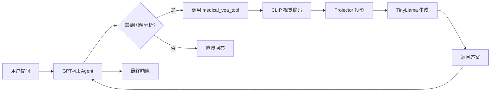

# Medical Assistant Agent 使用指南

## 概述

Medical Assistant Agent 是一个智能医学图像分析助手，结合了：
- 🤖 **GPT-4.1** 语言模型
- 👁️ **多模态视觉-语言模型** (CLIP + TinyLlama + Projector)
- 🔧 **LangChain ReAct Agent** 框架

## 架构

```
Medical-ACE/
├── src/
│   ├── agents/
│   │   ├── medical_assistant_agent.py  # 主 Agent
│   │   └── reflection_agent.py         # ACE 反思 Agent
│   └── tools/
│       └── medical_vqa_tool.py         # 医学 VQA 工具
├── inference.py                         # 多模态推理引擎
├── main.py                             # 主程序入口
└── projector_epoch2.pt                 # 训练好的投影器
```

## 快速开始

### 1. 环境配置

确保 `.env` 文件包含：

```bash
OPENAI_API_KEY=your_openai_api_key
LANGSMITH_API_KEY=your_langsmith_api_key  # 可选，用于追踪
LANGCHAIN_TRACING_V2=true
LANGCHAIN_PROJECT=Medical-ACE
```

### 2. 安装依赖

```bash
conda activate ACE
pip install -r requirements.txt
```

### 3. 运行方式

#### 方式 1：单次查询（推荐用于测试）

```bash
python main.py --mode single
```

#### 方式 2：批量查询

```bash
python main.py --mode batch
```

#### 方式 3：交互式模式

```bash
python main.py --mode interactive
```

#### 方式 4：LangSmith Studio (可视化调试)

```bash
langgraph dev --tunnel
```

然后访问显示的 URL 在 Studio 中可视化调试。

## 功能特性

### 支持的医学图像类型

- 🔬 **病理切片** (Histopathology)
- 🩻 **X-Ray** (胸片、骨骼等)
- 🧠 **CT/MRI** 扫描
- 🫀 **其他医学成像**

### Agent 能力

1. **图像分析**
   - 组织类型识别
   - 器官系统分类
   - 病理特征描述

2. **智能推理**
   - ReAct 模式推理
   - 工具调用决策
   - 上下文理解

3. **可追踪性**
   - LangSmith 集成
   - 完整调用链追踪
   - 性能监控

## 使用示例

### Python API 调用

```python
from src.agents import create_medical_assistant_agent, run_medical_assistant

# 创建 agent
agent = create_medical_assistant_agent(
    model_name="gpt-4.1",
    temperature=0.1,
    verbose=True
)

# 提问
query = """
Analyze the pathology image at 'image.png'. 
What type of tissue is shown and are there any abnormalities?
"""

response = run_medical_assistant(query, agent)
print(response)
```

### 异步调用

```python
import asyncio
from src.agents import create_medical_assistant_agent, arun_medical_assistant

async def analyze_images():
    agent = create_medical_assistant_agent()
    
    queries = [
        "Analyze image1.png - what organ is this?",
        "Look at image2.png - is this normal tissue?"
    ]
    
    for query in queries:
        response = await arun_medical_assistant(query, agent)
        print(response)

asyncio.run(analyze_images())
```

### 直接使用工具

```python
from src.tools import medical_vqa_tool

# 直接调用 VQA 工具（不使用 agent）
result = medical_vqa_tool.invoke({
    "image_path": "image.png",
    "question": "What is this tissue?",
    "projector_checkpoint": "projector_epoch2.pt"
})

print(result)
```

## 工作流程



## 高级功能

### 1. 自定义 Prompt

修改 `medical_assistant_agent.py` 中的 `MEDICAL_ASSISTANT_PROMPT`。

### 2. 添加更多工具

```python
from langchain_core.tools import tool

@tool
def custom_medical_tool(input_data: str) -> str:
    """Your custom tool description"""
    # Your implementation
    return result

# 在 create_medical_assistant_agent 中添加
tools = [medical_vqa_tool, custom_medical_tool]
```

### 3. 更换 LLM

```python
agent = create_medical_assistant_agent(
    model_name="gpt-4o",  # 或其他模型
    temperature=0.2
)
```

## 性能优化

### 首次加载优化

模型首次加载需要时间（下载 CLIP 和 TinyLlama）。后续调用会使用缓存。

### GPU 加速

inference.py 自动检测 GPU：
- ✅ 有 GPU：使用 CUDA
- ⚠️ 无 GPU：使用 CPU（较慢）

### 批量处理

使用 `--mode batch` 或异步 API 并发处理多个图像。

## 故障排除

### 问题 1: OpenAI API Key 错误

```
Error: OpenAI API key not found
```

**解决**：确保 `.env` 文件中设置了 `OPENAI_API_KEY`。

### 问题 2: 模型加载失败

```
Error: Projector checkpoint not found
```

**解决**：确保 `projector_epoch2.pt` 在项目根目录。

### 问题 3: 权限错误

```
PermissionError when downloading models
```

**解决**：检查 HuggingFace 缓存目录权限，或使用 `required_permissions: ['all']`。

## 注意事项

⚠️ **医疗免责声明**

此系统仅供研究和教育用途。AI 分析结果：
- ❌ **不能替代** 专业医疗诊断
- ❌ **不应用于** 临床决策
- ✅ **应由** 合格医疗专业人员验证

## 扩展阅读

- [LangChain 官方文档](https://docs.langchain.com)
- [LangGraph Studio 指南](https://docs.langchain.com/langgraph/studio)
- [ReAct Agent 论文](https://arxiv.org/abs/2210.03629)

## 贡献

欢迎提交 Issue 和 Pull Request！

## License

MIT License

